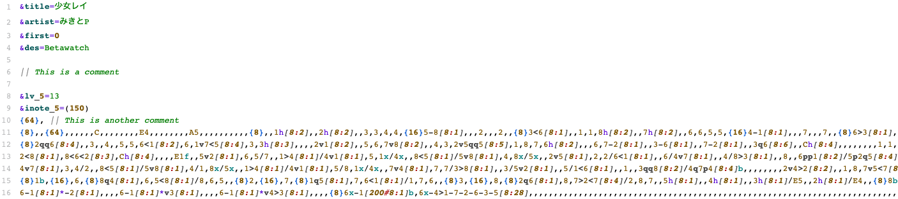

# tree-sitter-simai

A 3Simai grammar for [tree-sitter](https://tree-sitter.github.io/tree-sitter/). Supports festival additions to the language. Since Simai isn't a programming language, hacks were used in highlights.scm to make text highlighting decent.

**TODOS**
- Add more tests in corpus folder
- Validate parser using charts in the wild
- Tweak highlights.scm for better text highlighting
